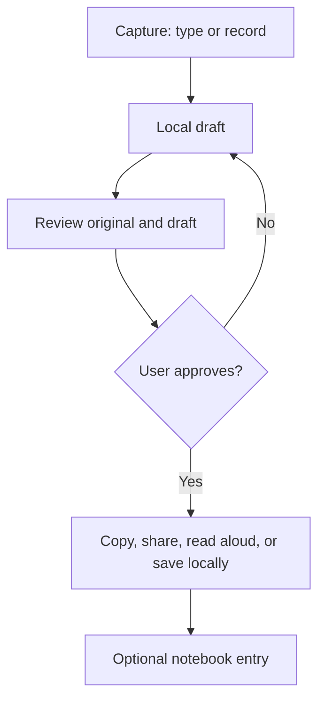

# Architecture and data flow

## First principles

1. Communication must remain possible when speech recognition, network, or a model fails.
2. The user's words are authoritative. AI may propose text, never silently replace it.
3. Audio and text are sensitive. Minimize collection, retention, and transport.
4. Real-world use includes noise, interruptions, tremor, fatigue, low light, poor connectivity, and assistive technology.
5. A communication tool must be useful without requiring a diagnosis.

## Product flow

The typed path is local-first. Recording is local until the user stops and the configured transcription endpoint accepts the clip. The current backend uses bounded batch transcription, not streaming; that is intentional until interruption, partial-result, and deletion semantics are validated.

## Components

| Component | Responsibility | Must not do |
| --- | --- | --- |
| React client | Capture, review, approval, local notebook, accessible output | Diagnose, silently rewrite, upload notebook data |
| FastAPI API | Short-lived session, bounded rewrite/transcription requests, safety limits | Store message bodies or audio by default |
| Provider adapter | Optional transcription through an explicitly enabled provider | Run when privacy acknowledgement is absent |
| ParkiBot link | User-controlled external navigation | Send text, audio, identifiers, or referrers |
| Test corpus | Regression and abuse cases | Contain real patient data without governance |

## Astra integration boundary

The UI and backend are model-agnostic. A future Astra rewrite adapter must return a candidate plus a stable request id, model name, and safety metadata. It must preserve meaning, numbers, negation, medication names, and uncertainty. The client should continue to require approval and should reject a result if the source revision changed while the request was in flight.

No health inference is part of the communication path. A later longitudinal voice notebook, if pursued, must be a separate consented research service with versioned feature extraction, calibration, and clinical review.
